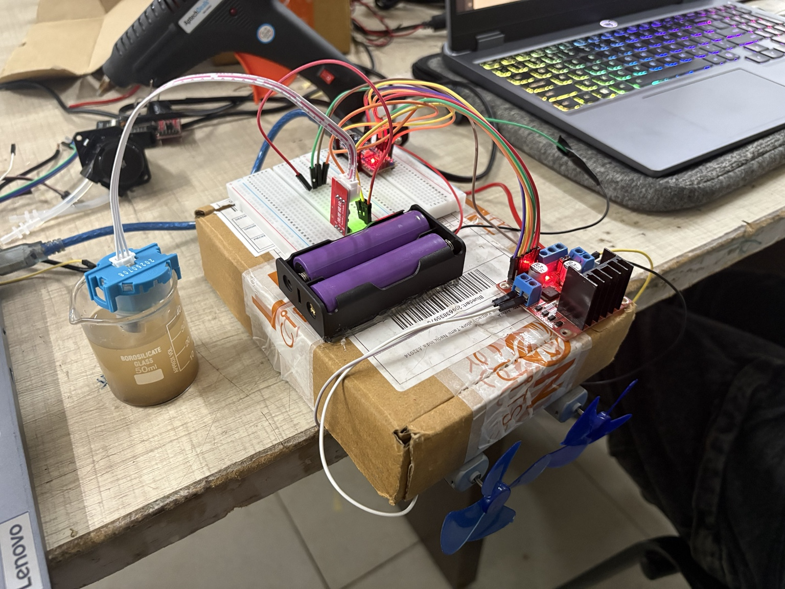
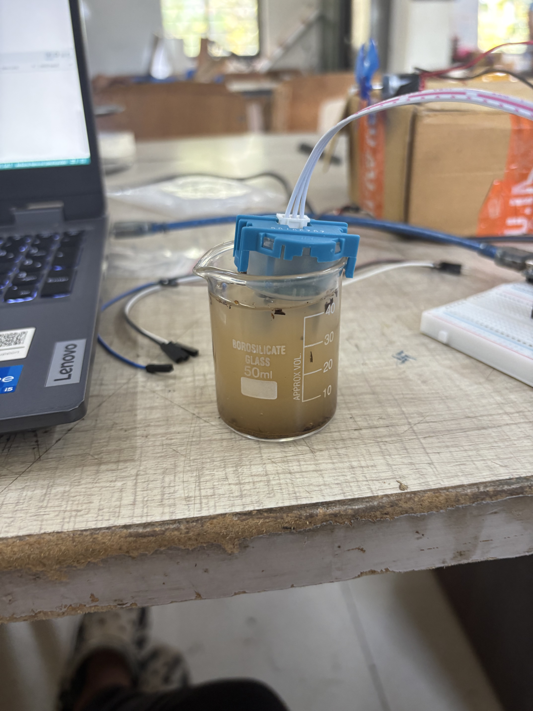
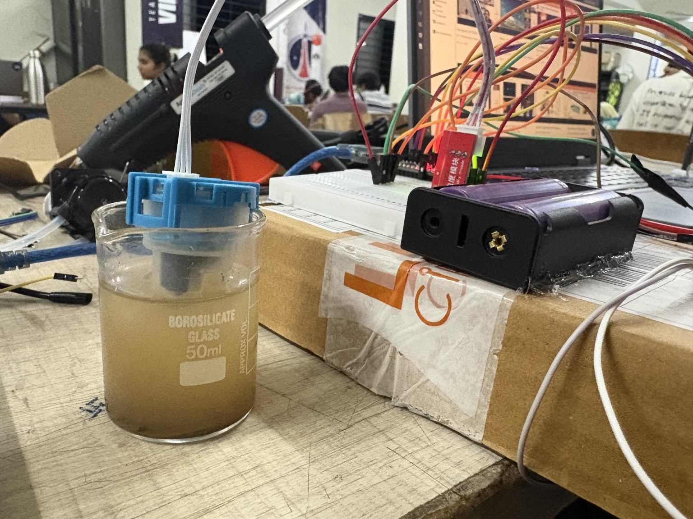
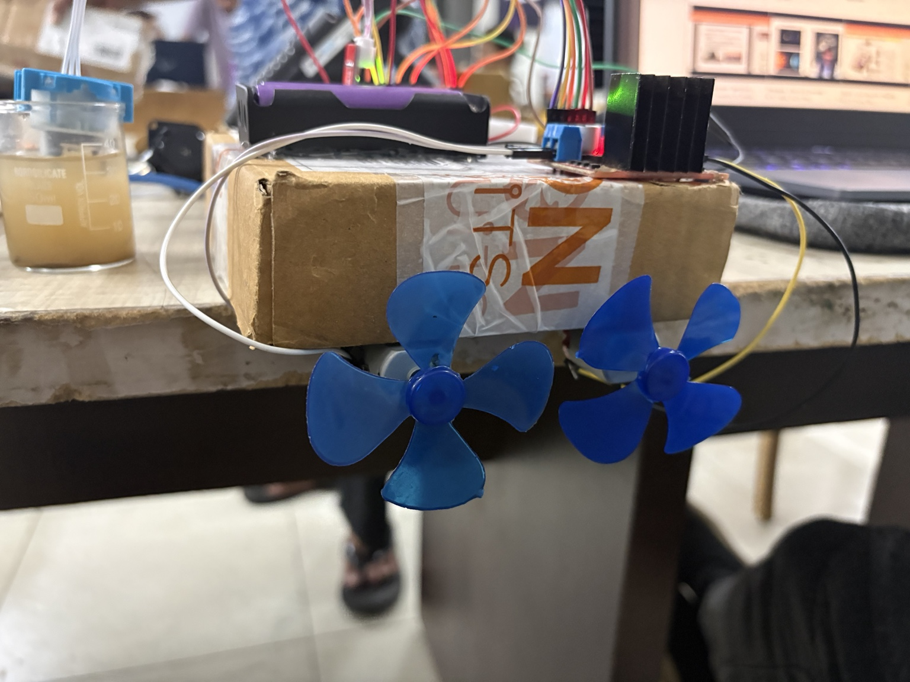

# 🌊 Autonomous Water Surface Cleaning Robot

An embedded systems project focused on autonomous water quality monitoring and floating debris collection. The system combines real-time turbidity sensing, servo-actuated waste collection, and differential-drive propulsion to create a low-cost autonomous platform for maintaining small water bodies such as ponds, reservoirs, and temple tanks.

## 📸 Project Gallery

### System Overview

<p align="center">
  
</p>

*Complete prototype showing the Arduino Nano controller, turbidity sensing module, propulsion system, and onboard power electronics.*

### Hardware Validation

<p align="center">
  
  
</p>

*Turbidity sensor calibration and integrated hardware testing during development.*

### Propulsion System

<p align="center">
  
</p>

*Differential-drive propulsion system powered by DC motors and controlled through an L298N motor driver.*

## 🎥 Demo Video

A complete demonstration of the robot showcasing autonomous debris collection, turbidity sensing, actuator control, and overall system operation.

[](https://youtu.be/Orj-t0zsLkE)

---

## 📄 Project Documentation

Detailed technical documentation covering system architecture, hardware design, software implementation, testing methodology, and performance evaluation.

[](./docs/Project_Report.pdf)

---

## Project Motivation

Water bodies in urban and semi-urban environments frequently suffer from floating plastic waste, organic debris accumulation, and declining water quality. Existing commercial cleaning solutions are often expensive and designed for large-scale deployments, making them impractical for smaller community-maintained water bodies.

This project explores a low-cost embedded alternative capable of both monitoring water conditions and performing autonomous debris collection. By integrating sensing, control, and actuation into a single platform, the system demonstrates how embedded systems can be applied to environmental monitoring and maintenance tasks.

---

## System Overview

The robot operates as a floating autonomous platform powered by an Arduino Nano. A turbidity sensor continuously monitors water clarity and provides feedback to the control system. Based on sensor readings and predefined operating conditions, the robot can activate a debris collection sequence using servo-driven paddles that guide floating waste into a collection bin.

The overall architecture consists of:

* Water quality sensing through turbidity measurement
* Autonomous decision-making using a finite state machine
* Differential-drive propulsion for movement
* Servo-actuated debris collection
* Real-time monitoring through serial communication
* Manual override functionality for testing and control

---

## Hardware Architecture

The system was developed using readily available and low-cost components:

| Component              | Purpose                     |
| ---------------------- | --------------------------- |
| Arduino Nano           | Central control unit        |
| Turbidity Sensor       | Water quality monitoring    |
| SG90 Servo Motors      | Debris collection mechanism |
| L298N Motor Driver     | Propulsion control          |
| DC Motors & Propellers | Surface navigation          |
| Floating Chassis       | Structural platform         |
| Battery Supply         | System power                |

The Arduino Nano acts as the central controller, processing sensor inputs and coordinating motor and servo actions while maintaining low power consumption and predictable real-time behavior.

---

## Control Logic

The software architecture follows a Finite State Machine (FSM) approach to ensure predictable operation and simplified debugging.

The robot transitions between multiple operating states, including:

* **Idle Mode** – Continuous monitoring of water conditions
* **Collection Mode** – Autonomous cleaning and debris collection
* **Manual Mode** – User-controlled operation through serial commands

This architecture enables modular development while remaining lightweight enough to run efficiently on an ATmega328P-based microcontroller.

---

## Technical Highlights

* Embedded systems design using Arduino Nano
* Turbidity sensor calibration and NTU estimation
* PWM-based motor and servo control
* Finite State Machine implementation
* Real-time sensor acquisition and processing
* Serial communication and monitoring
* Resource-constrained software development
* Environmental monitoring and automation

---

## Repository Structure

```text
.
├── README.md
├── docs/
│   └── Project_Report.pdf
└── code/
    ├── camera/
    ├── dummy_pumpandprop/
    ├── run_propellor_motor/
    ├── servo_motion/
    └── test_turbidity_sensor/
```

---

## Future Improvements

Potential future enhancements include:

* GPS-assisted navigation
* Wireless telemetry and remote monitoring
* Solar-powered operation
* IoT dashboard integration
* Computer vision based debris detection
* Autonomous path planning and coverage optimization

---

## Author

**Medha Sriram**
B.Tech Computer Science and Engineering (Artificial Intelligence & Machine Learning)
Vellore Institute of Technology (VIT)
